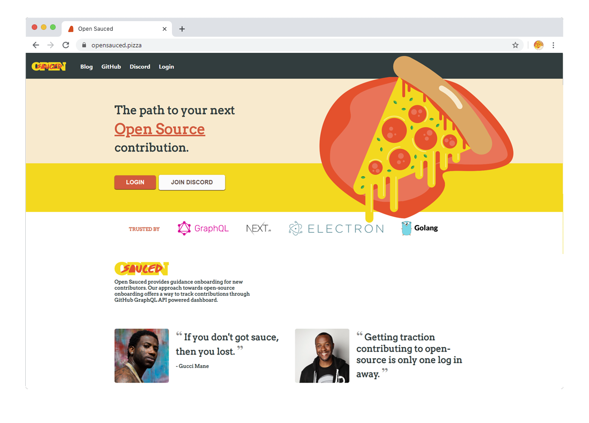
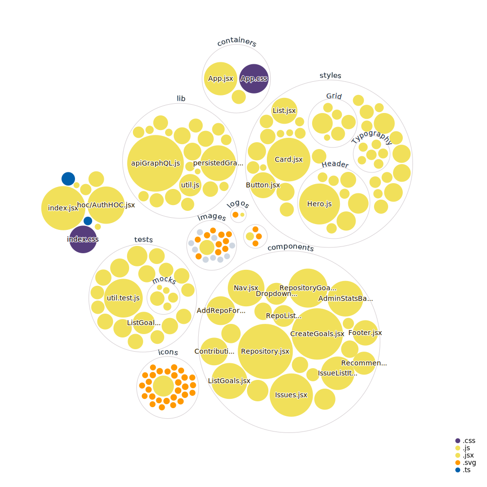

<div align="center">
  <br>
  
  <h1>🍕 Open Sauced 🍕</h1>
  <strong>The path to your next Open Source contribution</strong>
</div>
<br>
<p align="center">
  <a href="https://github.com/open-sauced/open-sauced/actions/workflows/codeql-analysis.yml">
    
  </a>
  <a href="https://github.com/open-sauced/open-sauced/actions/workflows/compliance.yml">
    
  </a>
  <a href="https://github.com/open-sauced/open-sauced/actions/workflows/release.yml">
    
  </a>
  <a href="https://github.com/open-sauced/open-sauced/actions/workflows/storybook.yml">
    
  </a>
  <a href="https://app.netlify.com/sites/open-sauced/deploys">
    
  </a>
  
  
  
  <a href="https://github.com/open-sauced/open-sauced/issues">
    
  </a>
  <a href="https://github.com/open-sauced/open-sauced/releases">
    
  </a>
  <a href="https://discord.gg/U2peSNf23P">
    
  </a>
  <a href="https://twitter.com/saucedopen">
    
  </a>
</p>

Open Sauced provides structured onboarding for new contributors to open source. This structure provides a way to track your next contributions by leveraging a unique dashboard built on top of the [GitHub GraphQL API](https://docs.github.com/en/free-pro-team@latest/graphql).

[
](https://opensauced.pizza)

## 📖 Prerequisites

In order to run the project from a container we need `node>=14`, `npm>=7` and `docker>=20` installed on our development machines or
use one of the listed cloud providers we support:

### Gitpod

> ✅ fully ready [integrated development environment](https://www.gitpod.io/docs/editors)

> ⭕ [VS Code settings sync is not ideal](https://github.com/gitpod-io/gitpod/issues/3733)

[](https://gitpod.io/#https://github.com/open-sauced/open-sauced)

[Gitpod](https://www.gitpod.io) is mostly free but has [extensive documentation](https://www.gitpod.io/docs/develop) for all its contributing features.

For [Vite](https://vitejs.dev) to work with Gitpod we need to use [a custom Dockerfile](https://www.gitpod.io/docs/config-docker) that lives under [.gitpod.Dockerfile](./.gitpod.Dockerfile).

Open Sauced comes with a pre-defined [.gitpod.yml](./.gitpod.yml) that should work out of the box in multiple [contribution scenarios](https://www.gitpod.io/docs/references/gitpod-yml).

### Replit

> ✅ fully ready [integrated development environment](https://replit.com/site/ide)

> ⭕ [modified contribution workflows](https://docs.replit.com/tutorials/06-github-and-run-button)

[](https://repl.it/github/open-sauced/open-sauced)

[Replit](https://replit.com/) is an old service that recently supported [NixOS](https://nixos.org/guides/nix-pills/enter-environment.html), enabling full customisation of the runner and project.

Open Sauced is configured with a shell environment supporting node@16 and npm@8. The build environment script lives in [shell.nix](./shell.nix) and the [repl config](https://docs.replit.com/programming-ide/configuring-repl) lives in [.replit](./replit).

### Codesandbox

> ✅ can be used as editor replacement
>
> ✅ supports deployment preview

> ⭕ [enforces custom package manager for stability](https://codesandbox.io/docs/configuration#sandbox-configuration)
>
> ⭕ low resources [free tier limitations](https://codesandbox.io/docs/faq#are-there-any-limitations-with-sandboxes)

[](https://codesandbox.io/s/github/open-sauced/open-sauced?fontsize=14&hidenavigation=1&theme=dark&previewwindow=console&runonclick=1)

### Stackblitz

> ✅ can be used as editor replacement
>
> ✅ supports deployment preview

> ⭕ [enforces custom package manager for stability](https://developer.stackblitz.com/docs/platform/turbo/)
>
> ⭕ limited documentation on [container limitations](https://developer.stackblitz.com/docs/platform/project-config)

[](https://stackblitz.com/github/open-sauced/open-sauced)

### Glitch

> ✅ can be used as editor replacement

> ✅ supports deployment preview

> ⭕ [enforces custom package manager for stability](https://help.glitch.com/kb/article/59-can-i-change-the-version-of-node-js-my-project-uses/)
>
> ⭕ does not support stacked hot module reload
>
> ⭕ severely low resources [free tier limitations](https://help.glitch.com/kb/article/17-what-are-the-technical-restrictions-for-glitch-projects/)

[](https://glitch.com/edit/#!/import/github/open-sauced/open-sauced)


## 🖥️ Local development

To install the application:

```shell
npm ci
```

To start a local copy of the app on port `3000`:

```shell
npm start
```

### 🧪 Test

For running the test suite, use the following command. Since the tests run in watch mode by default, some users may encounter errors about too many files being open. In this case, it may be beneficial to [install watchman](https://facebook.github.io/watchman/docs/install.html).

```shell
npm test
```

You can request a coverage report by running the following command:

```shell
npm run test:coverage
```

### 📦 Docker builds

A development preview can also be run from docker:

```shell
docker build -t open-sauced-dev .
docker run -p 8080:80 open-sauced-dev
```

Alternatively you can pull the production container and skip all builds: 

```shell
docker run -dit -p 8080:80 ghcr.io/open-sauced/open-sauced
```

### 🎨 Code linting

To check the code and styles quality, use the following command:

```shell
npm run lint
```

This will also display during development, but not break on errors.

To fix the linting errors, use the following command:

```shell
npm run format
```

### 🚀 Production deployment

A production deployment is a complete build of the project, including the build of the static assets.

```shell
npm run build
```

You can analyze the build by running the following command:

```shell
npm run build:analyze
```

### 🎭 Offline asset optimization

We also have a script for updating `.svg` files used in the project, you only need to run this if you add new assets:

```shell
npm run build:svgo
```

And one for `.png` and `.jpg` files:

```shell
npm run build:squoosh
```

### 🚧 Development debugging

Thanks to [antfu/vite-plugin-inpesct](https://github.com/antfu/vite-plugin-inspect) we can always inspect the bundles in development by navigating to [localhost:3000/__inspect/](http://localhost:3000/__inspect/) in your browser.

### 📙 Storybook

Storybook is being leveraged to mock out visual React components. The latest version of the design system can be found at this [URL](https://sauced-components.netlify.app/).

```shell
npm run storybook
```


### 🔑 Authentication

Authentication is handled through [OneGraph's AuthGuardian](https://www.onegraph.com/docs/auth_guardian.html) service.

### 💾 Database

This project uses GitHub as a database. When you login, you will be presented with a button to create a goals repository. That repository template lives at [open-sauced/goals-template](https://github.com/open-sauced/goals-template).

### 💨 Service Worker

This project uses the sw-precache to kickstart an offline cache. The offline cache only registers in production. If service needs to be manually removed make an **unregister** call from the registerServiceWorker.js import.

### 🌙 Dark Mode

This project supports "dark mode" styling, and by default it will follow the color preference on your device. It also allows for overriding this using buttons at the top right of the screen, which will persist the preference to local storage on your device. More info about color preference web API's can be found here: [MDN Web Docs](https://developer.mozilla.org/en-US/docs/Web/CSS/@media/prefers-color-scheme)

### 📝 Markdown Support

This project leverages [Remirror](https://remirror.io/) for a delightful experience in documenting your Open Source goals. The editor supports markdown features including heading levels, bulleted lists, text formatting, code snippets, and emojis!

## 🤝 Contributing

We encourage you to contribute to Open Sauced! Please check out the [Contributing guide](https://docs.opensauced.pizza/contributing/introduction-to-contributing/) for guidelines about how to proceed.

We have a commit utility called [@open-sauced/conventional-commit](https://github.com/open-sauced/conventional-commit) that helps you write your commits in a way that is easy to understand and process by others.

It is generally integrated as an `npm` script but you can run it with `npx` as well:

```shell
npm run push
```

For any other npm based project or dotnpmrc defaulting to `--yes`:

```shell
npx -y @open-sauced/conventional-commit
```

## 🍕 Community

Got Questions? Join the conversation in our [Discord](https://discord.gg/U2peSNf23P).  
Find Open Sauced videos and release overviews on our [YouTube Channel](https://www.youtube.com/channel/UCklWxKrTti61ZCROE1e5-MQ).

## 🎦 Repository Visualization 

[
](./src)

## ⚖️ LICENSE

MIT © [Open Sauced](LICENSE)
