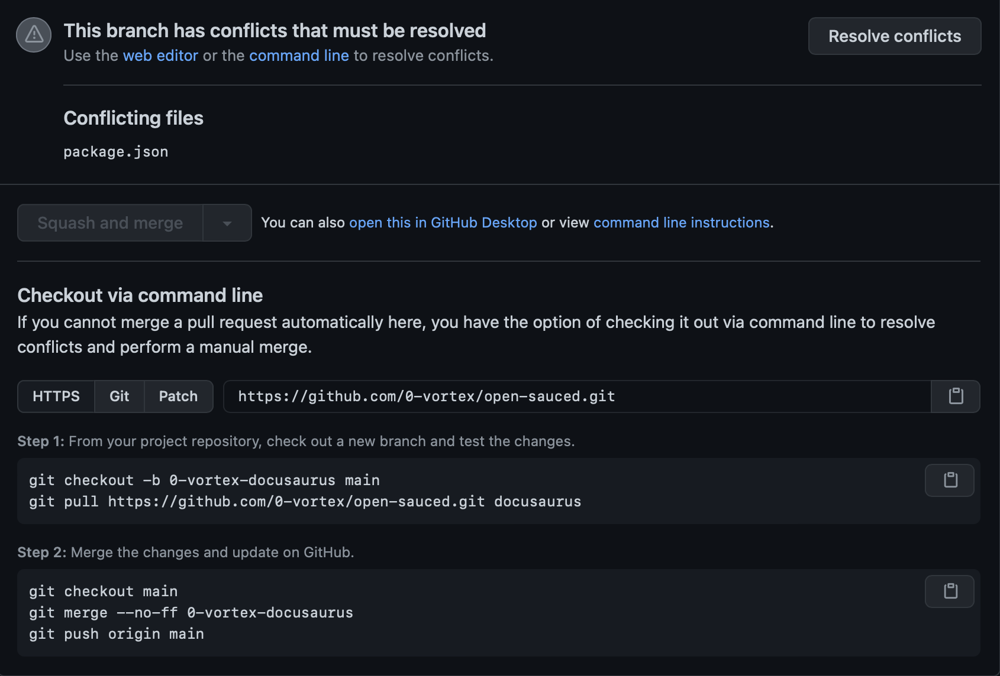
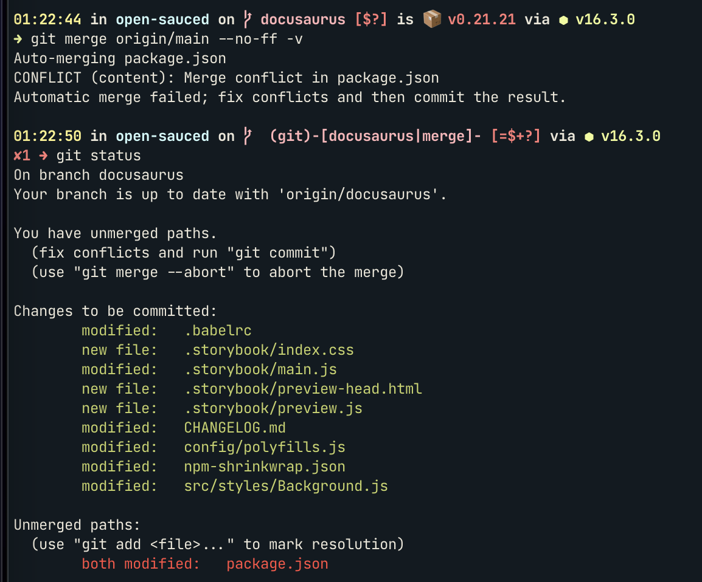
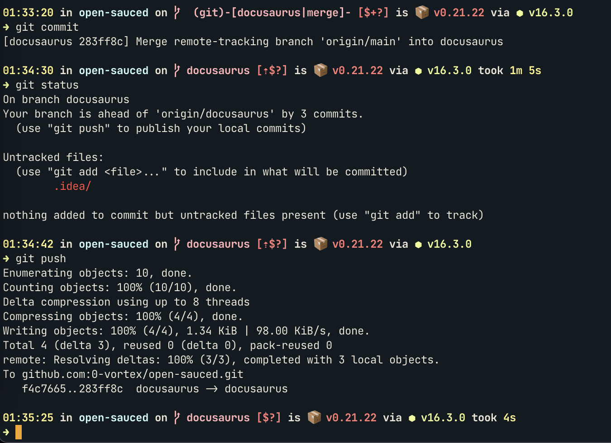
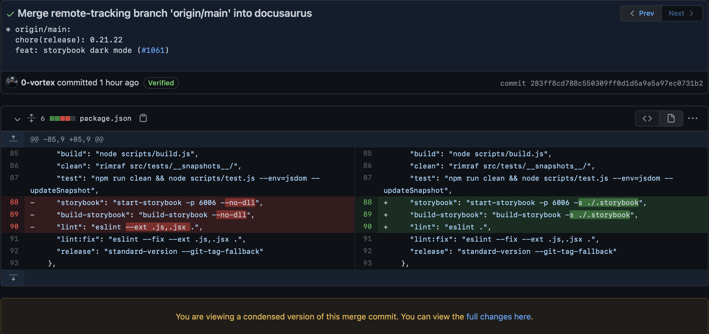

# Resolve merge conflicts

Pretty often when opening a pull request it is very likely to run into merge conflicts as the release process is generally updating `npm-shriknwrap.json`.

To better illustrate the commands listed here at will use commits and screenshots from [open-sauced#1078](https://github.com/open-sauced/open-sauced/pull/1078).

In literally every case it is advised _**not**_ to use the `Resolve conflicts` button as follows:



The above will at best achieve a ready to merge pull request with visible inconsistencies.

## Repository setup

Fork and clone the project using the `gh` command line interface:

```shell
gh repo clone 0-vortex/open-sauced
```

Running `git remote -v` will output:

```shell
origin git@github.com:0-vortex/open-sauced.git (fetch)
origin git@github.com:0-vortex/open-sauced.git (push)
upstream git@github.com:open-sauced/open-sauced.git (fetch)
upstream git@github.com:open-sauced/open-sauced.git (push)
```

Fork and clone the project using the `git` command line interface:

```shell
git clone git@github.com:0-vortex/open-sauced.git
```

Running `git remote -v` will output:

```shell
origin git@github.com:0-vortex/open-sauced.git (fetch)
origin git@github.com:0-vortex/open-sauced.git (push)
```

As an additional step for this tutorial we need to add the `upstream` remote:

```shell
git remote add upstream git@github.com:open-sauced/open-sauced.git
```

## Update 

First get the `main` branch changes:

```shell
git fetch origin --recurse-submodules=no --progress --prune
git checkout main --
git fetch upstream --recurse-submodules=no --progress --prune
git merge upstream/main --no-stat -v
```

## Merge with upstream

Then merge with the forked up-to-date `main` branch:

```shell
git merge origin/main --no-ff -v
```

You will see something similar to:



## Review changes

To see what the changes are do a:

```shell
git diff package.json
```

It will look like this:


## Resolve conflicts

Since this pull request does not modify the `package.json` file it is safe to fast forward the changes from `origin/main`:

```shell
# overwrite with origin/main changes 
git show :3:package.json > package.json
```

A more traditional way of doing the same thing is:

```shell
# make a local copy of all changes and use --theirs
# --theirs strategy overwrite with origin/main changes 
git show :1:package.json > base.package.json
git show :2:package.json > branch.package.json
git show :3:package.json > head.package.json
git merge-file -p --theirs \
    branch.package.json base.package.json head.package.json > package.json
```

## Commit changes

Not making any assumptions about editor preferences running this will open the configured editor with a default commit message:

```shell
git commit
```

That should look like this:


## Push updated pull request

One more security check to make sure your branch has not diverged and push:

```shell
git status
git push
```

It should look something like this:



## Review your pull request

The result of the above commands can be viewed at [283ff8cd788c550309ff0d1d5a9a5a97ec0731b2](https://github.com/open-sauced/open-sauced/pull/1078/commits/283ff8cd788c550309ff0d1d5a9a5a97ec0731b2)

GitHub will conveniently display only you merge conflict changes:



And it's ready to merge:


## Dependency updates

When dealing with dependency and lock file updates there are multiple use cases to consider, however as a baseline, the open sauced triage team will not prioritize parallel main features as seen in the roadmap.

However when that happens, it is advised to:
- fast-forward `npm-shrinkwrap.json` 
- fast-forward deleted and modified `upstream/main` changes to `package.json` 
- fast-forward your added lines to `package.json`
- run `npm ci` to delete local modules and create dependency resolution from `upstream/main`

Visual diffing is advised however not following the git commit history procedure will result in a rogue pull request that scope creeps into dependency updates. 

Generally speaking, just adding things to a lockfile will not be troublesome and since this is a licensed project, we should be careful when adding dependencies.
